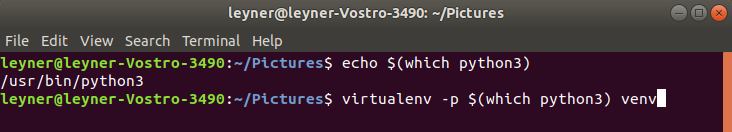

# bash concepts that you will need for your day to day jobs

## ls

this command is used to see what is inside of the directory where you are, there are some variants of the command one of the most importan is ls -ltr and ll, both do the same thing but ll does not work in all linux distributions. one really useful way to execute the command is with the addition of wildcards

## ls demo

## cd

cd command allow the movement of the user beetween directories, only executing cd will send you to the home directory (whatever you have configure as home directory), cd .. will take you one folder behind from your current position, cd follow by a path starting with slash will take you to a absolute path while a path not starting with slash will take you to a relative path. remember that while you are typing a direction you can press tab to autocomplete. cd - will take you to the position you were just before the last move.pwd show you were you currently are.When there are spaces in the direction you can put the whole path and you can use enviroment variables, this trick is used when an important folder is located in different paths in different servers like is the case with dev and prod servers 

## ls demo

## cat-head-tail

Commands for showing in screen the content of a file, using cat show all of the command, using the flag "head" along with the flag "-n" can return the first n lines of a document. using the flag "tail" give us the n lines of the document.

## cat-head-tail demo

## cp

This is the command we use for copying and pasting files, mkdir is the command we use forcreating folders, when you want to create all the folders required you pass the -p flag

## cp mkdir demo

## rm

This is the command we use for the deleting files. When you want to eliminate a whole folder we use the recursive version rm -r, if dont want to receive questions asking if you are sure about the delete operation you should pass the -f flag, if you dont want the files in the rubbish bin you should pass the -skipTrash flag

## rm demo

## history, pipe symbol and grep

Sometimes you use a command and later you forget the correct way to write that same command, the good new is that all of those command we execute are stored and we can see it executing the history command, and that generate another challenge, finding that one command inside all of all of that, the solution, we pass the result of one command to another another command with pipe symbol (the vertical line) and in that other command (in this case grep) we filter all the text generated taking only the lines that include a certain word. Grep can also be used to filter documents that contain certain lines as you can see in the image below

## history-pipe-grep demo

## bash redirections and sed

Sometimes you want the result of an execution to be reflected in another file, if you want to append that result you would {COMMAND_EXECUTED} > {FILE_WHERE_WE_WANT_TO_STORE_RESULTS}, but if you want to append the results you put the "greater than" symbol twice like this  {COMMAND_EXECUTED} >>{FILE_WHERE_WE_WANT_TO_STORE_RESULTS}. It'ss important to remember that when you do a redirection to a non-existent file, that file will be created by the command.

For the first example I used the sed command, this command is used to do substitution or find and replace activities.

Something you may see along with the redirecction is the EOF special word, this word is used for multiline redirection.

## chmod

Command used to changue the permissions of files and folder. To see the permissions of files and folder use the command ls -ltr (or ll in some linux distributions). The first colunm is the corresponding to the permissions, if it starts with the letter d it means is a folder, the first 3 letter reference the permissions that the ownner of the file have over the object, if you see the 3 letters (rwx) then you can read, write and execute the file, the next three letter correspond to the group permissions (all the people in that group), and the last three for all the people different from those in the group.

Permissions are assigned using the chmod command an three numbers corresponding to he sum of the permissions, permissions for readeing is a 4, permissions for writting is a 2 and permissions for reading is a 1.

If you want to assing all permissions to the owner, then,  in the first number after the chmod you would write the number 7 (because thats the sum of the three permissions), if you want to give reading and executing permissions to the group what you would do is writting the number 5 in the second number after the chmod(because the sum of the read permission 4 and executing ones 1 is 5), for anyone else you write the sum of the permissions in the third number after the chmod (0 for example if you dont want to give them any permissions).

## which

which is a command for various operating systems used to identify the location of executables.

In this case, I was creating a virtual enviroment in python so the result of the command is part of another command.

## searhing files by the things they got inside

When you need to know which is the file with certain phare inside, for example, I needed to know which file has the method WriteToAvro, so I executed the bash command grep -irl WriteToAvro as you can see in the picture below

## ignoring the error output

The > operator redirects the output usually to a file but it can be to a device. You can also use >> to append.

If you don't specify a number then the standard output stream is assumed, but you can also redirect errors:

> file redirects stdout to file
1> file redirects stdout to file

2> file redirects stderr to file

&> file redirects stdout and stderr to file
> file 2>&1 redirects stdout and stderr to file

/dev/null is the null device it takes any input you want and throws it away. It can be used to suppress any output.

Note that > file 2>&1 is an older syntax which still works, &> file is neater, but would not have worked on older systems.

# the vim editor

## important consideration

I usually prefer images and text to videos because the last one need more time, but I also understand that some concepts is better to see the whole process, so in this part of the tutorial I will give you the exact minute where I talk about that concept in the video 

